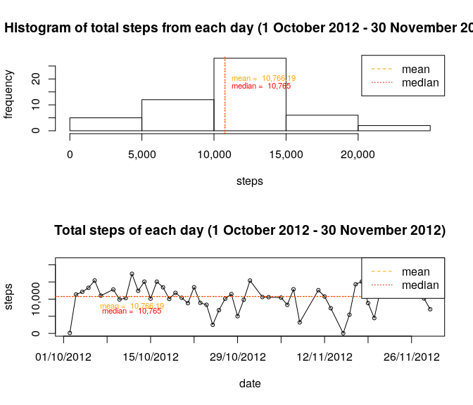
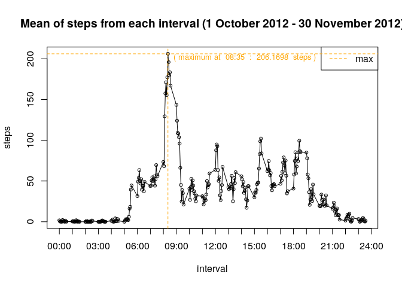
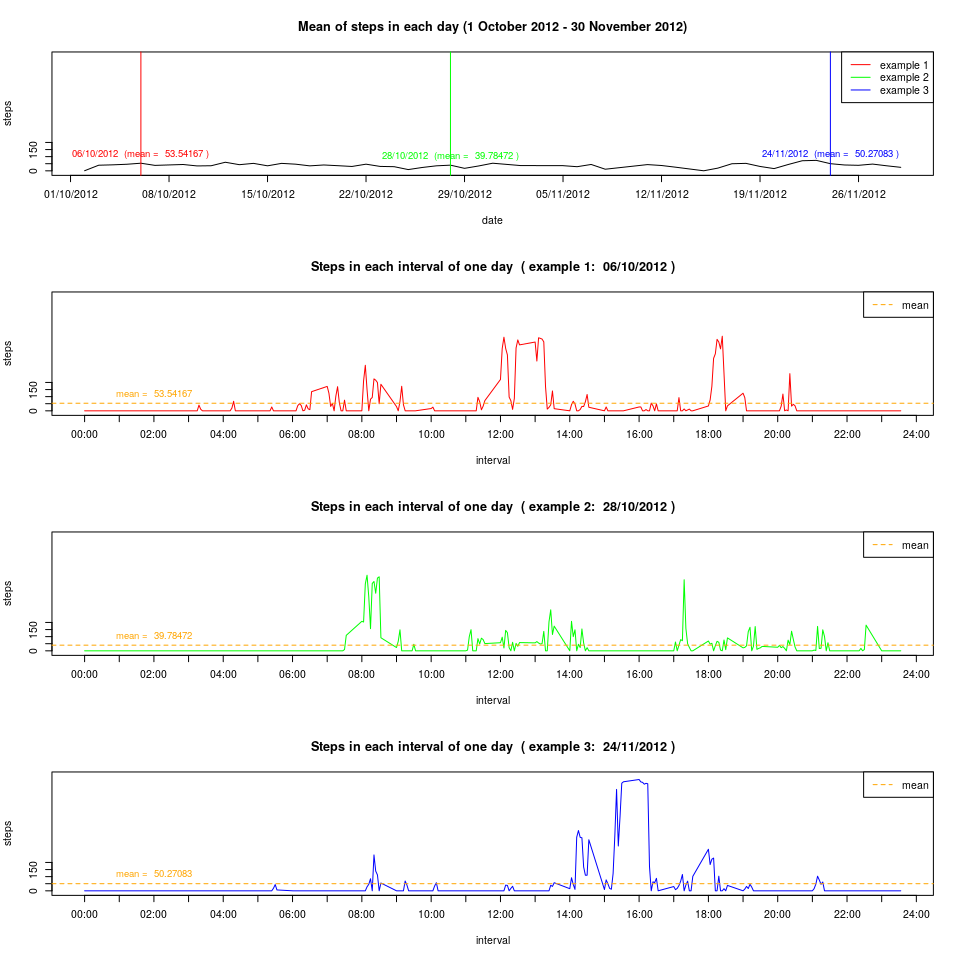
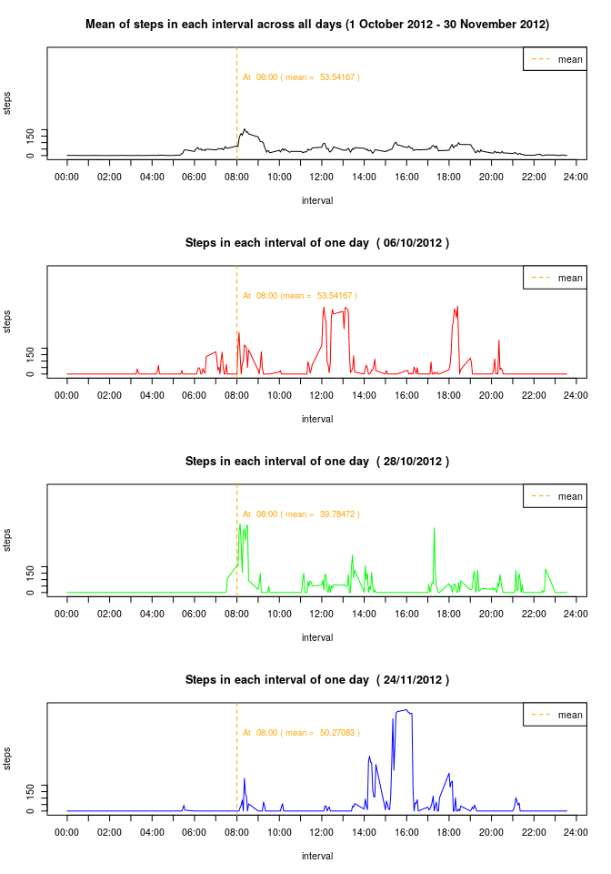
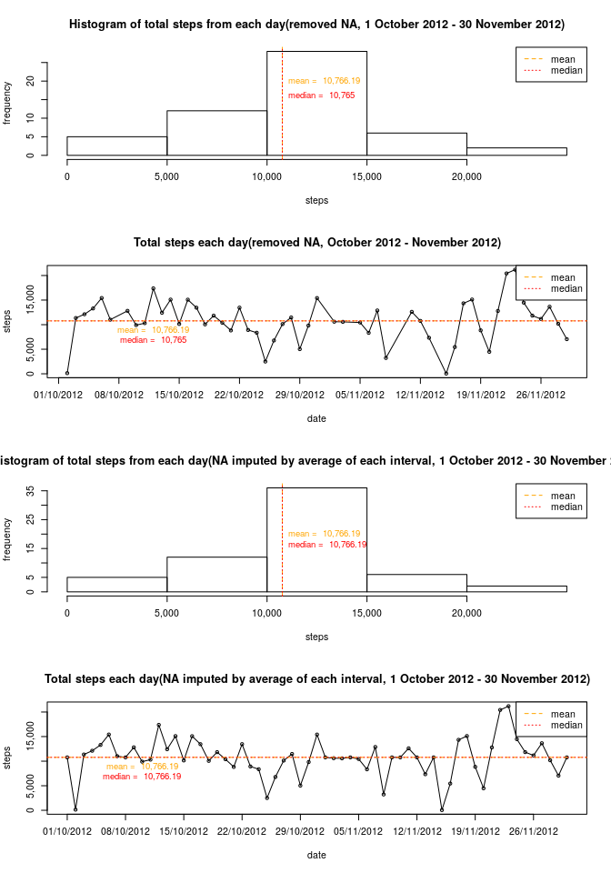
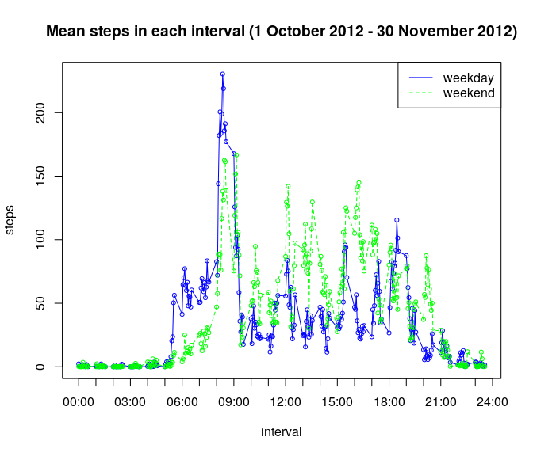

***** Date: 07/04/2019

With data from personal activity monitoring device. This device collects data at 5 minute interval through out the day from 2 months period(1 October 2012 - 30 November 2012). Data included number of steps taken in 5 minute intervals each day.

**Data source**  
* [Activity monitoring](https://d396qusza40orc.cloudfront.net/repdata%2Fdata%2Factivity.zip)  

**Variables**  
* **steps:** number of steps taking in a 5-minute interval(missing values are coded as NA)  
* **date:** the date on which measurement was taken in YYYY-MM-DD format  
* **interval:** indentifier for the 5-minute interval in which measurement was taken  

The dataset is stored in a comma-seperate-value(csv) file and there are a total of 17,568 observations in this dataset

## Section 1: Loading and preprocessing the data
Load data source from file and prepare data to be in format that ready for analysis.

```r
library(dplyr)
```

```
## 
## Attaching package: 'dplyr'
```

```
## The following objects are masked from 'package:stats':
## 
##     filter, lag
```

```
## The following objects are masked from 'package:base':
## 
##     intersect, setdiff, setequal, union
```

```r
# function to extract number of which day of the week
get_hour <- function(interval){
    hour <- sprintf("%04d", interval)
    h <- substring(hour,0,2)
    m <- substring(hour,3,5)
    hour <- paste(h, m, sep=":")
    hour
}

# function to format number to be in format that contain comma for big number
format_number <- function(digit){
    format_data <- format(c(digit),big.mark=",", trim=TRUE)
    format_data
}

# function to format date object to datestring
format_date_string <- function(date){
    date_string <- format(date, format="%d/%m/%Y")
    date_string
}

# specify data source filename
prefix_path <- "../repdata_data_activity/"
filename <- "activity.csv"

# load csv data
file_path <- paste(prefix_path, filename, sep="")
data <- read.csv(file_path, header=TRUE, sep=",")

# convert date string to date object
data$date <-  as.Date(as.character(data$date), "%Y-%m-%d") 

# filtered data to filter out row which contains NA step data
filtered_data <- subset(data, !is.na(steps))

# generage sequence of specify data for using in ploting graph (x or y axis)
seq_hour <- seq(0, 2400, by=100)
seq_date <- seq(min(data$date),max(data$date), by="7 days")
seq_steps <- seq(0, max(filtered_data$steps), by=200)
steps_rng <- range(0, max(filtered_data$steps))
```

###1.1 Example of dataset

```
##    steps       date interval
## 1     NA 2012-10-01        0
## 2     NA 2012-10-01        5
## 3     NA 2012-10-01       10
## 4     NA 2012-10-01       15
## 5     NA 2012-10-01       20
## 6     NA 2012-10-01       25
## 7     NA 2012-10-01       30
## 8     NA 2012-10-01       35
## 9     NA 2012-10-01       40
## 10    NA 2012-10-01       45
```
###1.2 Percentage of steps data which NA 

```
## [1] 13.11475
```

## Section 2: What is mean total number of steps taken per day?
Summary data to get the total steps taken per day. Plot histgram of total steps taken each day and calculate mean/median of total number of steps taken per day.

```r
# summary steps data by doing summation of total of steps taking each day for all day in datasets
summary_each_day_na <- filtered_data  %>% group_by(date) %>% summarise( total=sum(steps))

# calculate mean/median of total steps taken each day 
median_val = median(summary_each_day_na$total)
mean_val = mean(summary_each_day_na$total)

# generage sequence of total steps for using in ploting graph (x or y axis)
seq_total_steps <- seq(0, max(summary_each_day_na$total), by=5000)

# plot graph
par(mfcol=c(2,1))
with(summary_each_day_na, {
   
    # plot historgram of total steps taken each day
    hist(total, xlab="steps", ylab="frequency", xaxt="n", main="Histogram of total steps from each day (1 October 2012 - 30 November 2012)")
    axis(side=1, at=seq_total_steps, labels = format_number(seq_total_steps) ) 
    abline(v = mean_val, col="orange", lty=2)
    abline(v = median_val, col="red", lty=3)
    legend("topright", lty=c(2, 3), col=c("orange", "red"), legend=c("mean", "median"))
    text(mean_val, 20, cex=0.7, pos=4, col="orange", labels= paste("mean = ", format_number(mean_val) ))
    text(median_val, 17, cex=0.7, pos=4, col="red", labels= paste("median = ", format_number(median_val) ))
    
    # plot data of total steps taken each day
    plot(date, total, xlab="date", ylab="steps", type="l", xaxt="n", yaxt="n", main="Total steps of each day (1 October 2012 - 30 November 2012)")
    points(date, total, pch=1, cex=0.7 )
    axis(side=1, at=seq_date, labels = format_date_string(seq_date) ) 
    axis(side=2, at=seq_total_steps, labels = format_number(seq_total_steps) ) 
    abline(h = mean_val, col="orange", lty=2)
    abline(h = median_val, col="red", lty=3)
    text(date[10], mean_val-100, cex=0.7, pos=1, col="orange", labels= paste("mean = ", format_number(mean_val) ))
    text(date[10], mean_val-1500, cex=0.7, pos=1, col="red", labels= paste("median = ", format_number(median_val) ))
    legend("topright", lty=c(2, 3), col=c("orange", "red"), legend=c("mean", "median"))
    
})
```

<!-- -->


## Section 3: What is the average daily activity pattern?
Summary data for average steps taken in each 5-minute interval of the day across all days in the dataset and calculate which interval contains the maximum number of steps.

```r
# summary steps data by doing mean of steps taken in each 5-minute interval across all day
summary_each_interval <- filtered_data  %>% group_by(interval) %>% summarise( average=mean(steps))

# calculate which of interval contain maximum steps taken in each 5-minute interval
maximum_steps_idx <- which.max(summary_each_interval$average)
maximum_steps_interval <- summary_each_interval[maximum_steps_idx,]

# generage sequence of mean steps of each 5-minute interval for using in ploting graph (x or y axis)
seq_steps <- seq(0, max(summary_each_interval$average), by=50)

# plot graph
par(mfcol=c(1,1))
with(summary_each_interval, {

    # plot graph of mean steps taken in each 5-minute interval across all day
    plot(interval, average, ylab="steps", type="l", xaxt="n", yaxt="n", xlab="interval", main="Mean of steps from each interval (1 October 2012 - 30 November 2012)")
    points(interval, average, pch=1, cex=0.7)
    axis(side=1, at=seq_hour, labels = get_hour(seq_hour) ) 
    axis(side=2, at=seq_steps, labels = format_number(seq_steps) ) 
    legend("topright", legend=c("max"), col=c("orange"), lty=c(2))

    abline(h = maximum_steps_interval$average, col="orange", lty=2, cex=2)
    abline(v = maximum_steps_interval$interval, col="orange", lty=2, cex=2)
    text(maximum_steps_interval$interval, maximum_steps_interval$average-5, col="orange", pos=4, cex = 0.8, labels=paste("( maximum at ", get_hour(maximum_steps_interval$interval), " : ", format_number(maximum_steps_interval$average), " steps )") )
})
```

<!-- -->

## Section 4: Imputing missing values  
In dataset, there are a number of days/intervals where there are missing value(coded as NA). There presence of missing days may introduce bias into some calculations or summaries of the data.  

Calculate the total number of missing values in datasets. Devise strategy for filling in all of the missing values in the dataset and make a new dataset which is equal to the original but with the missing data filled in. Make a histogram of total number of steps taken each and calculate the mean/median total number of steps taken per day.  

##### Total number of missing value in dataset

```
## [1] "2304  of  17568"
```

* Do these values differ from the estimates from the first part of the assignment?    
* What is the impact of imputing missing data on the estimates of the total daily number of steps  

### 4.1 analyze whether average steps of each 5-minutes interval by each date can be used as impute value  
Show informations which are sampled from 3 selected days with average steps(calculated data) from each 5-minutes interval of that day and steps(raw data) from each 5-minutes interval of a day  

```r
# summary steps data by doing mean of steps taken in each 5-minute interval of each day
summary_each_day <- filtered_data  %>% group_by(date) %>% summarise( average=mean(steps))
unique_date <- unique(filtered_data$date)

# filter data of each sample date 
selected_date1 <- unique_date[5]
selected_date2 <- unique_date[length(unique_date)/2]
selected_date3 <- unique_date[length(unique_date)-5]
example_day1 <- subset(filtered_data, date %in% selected_date1)
example_day2 <- subset(filtered_data, date %in% selected_date2)
example_day3 <- subset(filtered_data, date %in% selected_date3)
summary_date1 <- subset(summary_each_day, date==selected_date1)
summary_date2 <- subset(summary_each_day, date==selected_date2)
summary_date3 <- subset(summary_each_day, date==selected_date3)
# plot graph
par(mfrow=c(4,1))
with(summary_each_day, {
    
    # plot graph of mean of steps in each interval of each day
    plot(date, average, xlab="date", ylab="steps", type="l",  xaxt="n", yaxt="n", ylim = steps_rng, main="Mean of steps in each day (1 October 2012 - 30 November 2012)" )
    axis(side=1, at=seq_date, labels=format_date_string(seq_date) ) 
    axis(side=2, at=seq_steps, labels = format_number(seq_steps) ) 
    abline(v = selected_date1, col="red")
    abline(v = selected_date2, col="green")
    abline(v = selected_date3, col="blue")
    text(selected_date1, summary_date1$average , cex=0.9, pos=3, col="red", labels= paste(format_date_string(selected_date1), " (mean = ", format_number(summary_date1$average), ")"  ))
    text(selected_date2, summary_date2$average , cex=0.9, pos=3, col="green", labels= paste(format_date_string(selected_date2), " (mean = ", format_number(summary_date2$average), ")" ))
    text(selected_date3, summary_date3$average , cex=0.9, pos=3, col="blue", labels= paste(format_date_string(selected_date3), " (mean = ", format_number(summary_date3$average ), ")" ))
    legend("topright", legend=c("example 1", "example 2", "example 3"), col=c("red", "green", "blue"), lty=c(1, 1, 1))
})

# plot graph of steps taken in each 5-minutes interval of specify sample date
with(example_day1,{
    
    label <- paste("Steps in each interval of one day ", "( example 1: ", format_date_string(selected_date1), ")")
    mean_val <- mean(example_day1$steps)
    
    plot(interval, steps, col="red", type="l",  xaxt="n", yaxt="n", ylim = steps_rng, main=label )
    axis(side=1, at=seq_hour, labels = get_hour(seq_hour) ) 
    axis(side=2, at=seq_steps, labels = format_number(seq_steps) ) 
    text(200, mean_val, cex=0.9, pos=3, col="orange", labels= paste("mean = ", format_number(mean_val) ))
    abline(h=mean(example_day1$steps), col="orange", lty=2)
    legend("topright", legend=c("mean"), col=c("orange"), lty=c(2))
})

# plot graph of steps taken in each 5-minutes interval of specify sample date
with(example_day2,{
    label <- paste("Steps in each interval of one day ", "( example 2: ", format_date_string(selected_date2) , ")")
    mean_val <- mean(example_day2$steps)
    
    plot(interval, steps, col="green", type="l",  xaxt="n", yaxt="n", ylim = steps_rng, main=label )
    axis(side=1, at=seq_hour, labels = get_hour(seq_hour) ) 
    axis(side=2, at=seq_steps, labels = format_number(seq_steps) ) 
    text(200, mean_val, cex=0.9, pos=3, col="orange", labels= paste("mean = ", format_number(mean_val) ))
    abline(h=mean(example_day2$steps), col="orange", lty=2)
    legend("topright", legend=c("mean"), col=c("orange"), lty=c(2))
})

# plot graph of steps taken in each 5-minutes interval of specify sample date
with(example_day3,{
    label <- paste("Steps in each interval of one day ", "( example 3: ", format_date_string(selected_date3), ")")
    mean_val <- mean(example_day3$steps)
    
    plot(interval, steps, col="blue", type="l",  xaxt="n", yaxt="n", ylim = steps_rng, main=label )
    axis(side=1, at=seq_hour, labels = get_hour(seq_hour) ) 
    axis(side=2, at=seq_steps, labels = format_number(seq_steps) ) 
    text(200, mean_val, cex=0.9, pos=3, col="orange", labels= paste("mean = ", format_number(mean_val) ))
    abline(h=mean(example_day3$steps), col="orange", lty=2)
    legend("topright", legend=c("mean"), col=c("orange"), lty=c(2))
})
```

<!-- -->

### 4.2 analyze whether average steps on each 5-minutes interval across all day can be used as impute data for missing value
Show information of a single 5-minutes interval with steps(raw data) collect in each day and steps(average) calculated across all days   

```r
# summary steps data by doing mean of steps taken in each 5-minute interval across all day
summary_interval_data <- filtered_data  %>% group_by(interval) %>% summarise( average=mean(steps), median=median(steps), total=sum(steps))
unique_date <- unique(filtered_data$date)

# filter data of each sample date 
selected_date1 <- unique_date[5]
selected_date2 <- unique_date[length(unique_date)/2]
selected_date3 <- unique_date[length(unique_date)-5]
example_day1 <- subset(filtered_data, date %in% selected_date1)
example_day2 <- subset(filtered_data, date %in% selected_date2)
example_day3 <- subset(filtered_data, date %in% selected_date3)

# generate sequence of interval for using as plot data on x or y axis
selected_period <- subset(summary_interval_data, interval==800)

# plotting graph
par(mfrow=c(4,1))
with(summary_interval_data, {
    
    # plot graph of average steps taken in each 5-minutes interval across all days
    plot(interval, average, xlab="interval", ylab="steps", type="l", xaxt="n", yaxt="n", ylim = steps_rng, main="Mean of steps in each interval across all days (1 October 2012 - 30 November 2012)")
    axis(side=1, at=seq_hour, labels = get_hour(seq_hour) ) 
    axis(side=2, at=seq_steps, labels = format_number(seq_steps) ) 
    abline(v=seq_hour[9], col="orange", lty=2)
    legend("topright", legend=c("mean"), col=c("orange"), lty=c(2))
    text(800, 600, cex=0.9, pos=4, col="orange", labels= paste("At ", get_hour(selected_period$interval), "( mean = ", format_number(mean(example_day1$steps) ), ")" ))
    legend("topright", legend=c("mean"), col=c("orange"), lty=c(2))
})

# plot graph of steps taken in each 5-minutes interval of sample date
with(example_day1,{
    label <- paste("Steps in each interval of one day ", "(", format_date_string(selected_date1), ")")
    plot(interval, steps, xlab="interval", ylab="steps", type="l", col="red", xaxt="n", yaxt="n", ylim = steps_rng, main=label)
    axis(side=1, at=seq_hour, labels = get_hour(seq_hour) ) 
    axis(side=2, at=seq_steps, labels = format_number(seq_steps) ) 
    abline(v=seq_hour[9], col="orange", lty=2)
    text(800, 600, cex=0.9, pos=4, col="orange",  labels= paste("At ", get_hour(selected_period$interval), "(mean = ", format_number(mean(example_day1$steps) ), ")" ))
    legend("topright", legend=c("mean"), col=c("orange"), lty=c(2))
})

# plot graph of steps taken in each 5-minutes interval of sample date
with(example_day2,{
    label <- paste("Steps in each interval of one day ", "(", format_date_string(selected_date2), ")")
    plot( interval, steps, xlab="interval", ylab="steps", type="l", col="green", xaxt="n", yaxt="n", ylim = steps_rng, main=label)
    axis(side=1, at=seq_hour, labels = get_hour(seq_hour) ) 
    axis(side=2, at=seq_steps, labels = format_number(seq_steps) ) 
    abline(v=seq_hour[9], col="orange", lty=2)
    text(800, 600, cex=0.9, pos=4, col="orange",  labels= paste("At ", get_hour(selected_period$interval), "( mean = ", format_number(mean(example_day2$steps) ), ")" ))
    legend("topright", legend=c("mean"), col=c("orange"), lty=c(2))
})

# plot graph of steps taken in each 5-minutes interval of sample date
with(example_day3,{
    label <- paste("Steps in each interval of one day ", "(", format_date_string(selected_date3), ")")
    plot( interval, steps, xlab="interval", ylab="steps", type="l", col="blue", xaxt="n", yaxt="n", ylim = steps_rng, main=label)
    axis(side=1, at=seq_hour, labels = get_hour(seq_hour) ) 
    axis(side=2, at=seq_steps, labels = format_number(seq_steps) ) 
    abline(v=seq_hour[9], col="orange", lty=2)
    text(800, 600, cex=0.9, pos=4, col="orange", labels= paste("At ", get_hour(selected_period$interval), "( mean = ", format_number(mean(example_day3$steps) ), ")" ))
    legend("topright", legend=c("mean"), col=c("orange"), lty=c(2))
})
```

<!-- -->

### 4.3 impute missing value using calcuated value of mean steps of each 5-minutes interval across all days
From 4.1, 4.2, there are some informations we can study from the graph 
  
* from 4.1 in case we impute NA value with the mean steps taken in a days it seems steps data in each interval of a day is vary in time for example at 00:00 - 06:00 there are quite few steps taken but at 08:00-09:00 steps data was taken more than 100 hundred in the sample dates. The the mean steps through a day might be vary in time.    
* from 4.2 in case we impute NA value with the mean steps taken in each 5-minutes interval across all days for example at 00:00 - 05:00 there are quite few steps taken at this period of time and data quite the same in each of 3 sample date but at 08:00-09:00 amount of steps vary from 100-400 steps in each 3 sample date. The average steps of each 5-minutes interval are still vary from each of 3 sample date.  

In this work, I use average steps taken in each 5-minutes interval across all days to imputed NA data available in datasets.  
    


```r
# using impute value from each 5-minutes interval across all days to impute NA value in dataset
new_data <- merge(data, summary_each_interval, by = "interval", all.x = TRUE)
new_data$steps <- ifelse(is.na(new_data$steps), new_data$average, new_data$steps)

# summary total steps taken each day from new dataset with impute value
summary_each_day_impute <- new_data %>% group_by(date) %>% summarise( total=sum(steps) )

# calculate mean/median of total steps taken each day from dataset which removed NA
median_val = median(summary_each_day_na$total)
mean_val = mean(summary_each_day_na$total)

# generate sequence of total steps using for ploting graph x or y axis
seq_total_steps <- seq(0, max(summary_each_day_na$total), by=5000)
rng_steps <- range(summary_each_day_na$total, summary_each_day_impute$total)

# plot graph
par(mfrow=c(4,1))
with(summary_each_day_na, {
   
    # plot histogram of total steps taken each day using dataset which removed NA
    hist(total, xlab="steps", ylab="frequency", xaxt="n", main="Histogram of total steps from each day(removed NA, 1 October 2012 - 30 November 2012)" )
    axis(side=1, at=seq_total_steps, labels = format_number(seq_total_steps) )
    abline(v = mean_val, col="orange", lty=2)
    abline(v = median_val, col="red", lty=3)
    text(mean_val, 20, cex=0.9, pos=4, col="orange", labels= paste("mean = ", format_number(mean_val) ))
    text(median_val, 16, cex=0.9, pos=4, col="red", labels= paste("median = ", format_number(median_val) ))
    legend("topright", lty=c(2, 3), col=c("orange", "red"), legend=c("mean", "median"))
    
    # plot graph of total steps taken each day using data which remove NA
    plot(date, total, ylab="steps", main="Total steps each day(removed NA, October 2012 - November 2012)", type="l",  xaxt="n", yaxt="n", ylim=rng_steps)
    points(date, total, pch=1, cex=0.7 )
    axis(side=1, at=seq_date, labels = format_date_string(seq_date)) 
    axis(side=2, at=seq_total_steps, labels = format_number(seq_total_steps) ) 
    abline(h = mean_val, col="orange", lty=2)
    abline(h = median_val, col="red", lty=3)
    text(date[10], mean_val-150, cex=0.9, pos=1, col="orange", labels= paste("mean = ", format_number(mean_val) ))
    text(date[10], mean_val-2200, cex=0.9, pos=1, col="red", labels= paste("median = ", format_number(median_val) ))
    legend("topright", lty=c(2, 3), col=c("orange", "red"), legend=c("mean", "median"))
    
})

# calculate mean/median of total steps taken each day from dataset which impute NA value with mean steps taken in each 5-minutes interval across all day
mean_val = mean(summary_each_day_impute$total)
median_val = median(summary_each_day_impute$total)

# generate sequence of total steps using for ploting graph x or y axis
seq_total_steps <- seq(0, max(summary_each_day_impute$total), by=5000)

with(summary_each_day_impute, {

    # plot histogram of total steps taken each day using dataset which impute NA value with mean steps taken in each 5-minutes interval across all day
    hist(total, xlab="steps", ylab="frequency", main="Histogram of total steps from each day(NA imputed by average of each interval, 1 October 2012 - 30 November 2012) ", xaxt="n")
    axis(side=1, at=seq_total_steps, labels = format_number(seq_total_steps) ) 
    abline(v = mean_val, col="orange", lty=2)
    abline(v = median_val, col="red", lty=3)
    text(mean_val, 20, cex=0.9, pos=4, col="orange", labels= paste("mean = ", format_number(mean_val) ))
    text(median_val, 16, cex=0.9, pos=4, col="red", labels= paste("median = ", format_number(median_val) ))
    legend("topright", lty=c(2, 3), col=c("orange", "red"), legend=c("mean", "median"))
    
    # plot graph of total steps taken each day using data which impute NA value with mean steps taken in each 5-minutes interval across all day
    plot(date, total, ylab="steps", main="Total steps each day(NA imputed by average of each interval, 1 October 2012 - 30 November 2012)", xaxt="n", yaxt="n", type="l", ylim=rng_steps )
    points(date, total, pch=1, cex=0.7)
    axis(side=1, at=seq_date, labels=format_date_string(seq_date) ) 
    axis(side=2, at=seq_total_steps, labels = format_number(seq_total_steps) ) 
    abline(h = mean_val, col="orange", lty=2)
    abline(h = median_val, col="red", lty=3)
    text(date[10], mean_val-150, cex=0.9, pos=1, col="orange", labels= paste("mean = ", format_number(mean_val) ))
    text(date[10], mean_val-2200, cex=0.9, pos=1, col="red", labels= paste("median = ", format_number(median_val) ))
    legend("topright", lty=c(2, 3), col=c("orange", "red"), legend=c("mean", "median"))
})
```

<!-- -->


## Section 5: Are there differences in activity patterns between weekdays and weekends?  
From new dataset(imputed NA), seperate data into 2 datasets: weekday, weekend. Summary the each dataset for the average steps taken in each 5-minutes interval across all days. Make a plot show different of average steps taken in each 5-minutes interval between weekday and weekend.  


```r
# generate factor: weekday/weekend
new_data$day_type <- ifelse( ( as.POSIXlt(new_data$date)$wday %in% c(6, 0)), 'weekend', 'weekday' )
new_data$day_type <- factor(new_data$day_type, levels=c("weekday", "weekend"))

# seperate data as weekday/weekend data
weekday_data <- subset(new_data, day_type=="weekday")
weekend_data <- subset(new_data, day_type=="weekend")

# summary weekday/weekend data by making mean steps taking in each 5-minutes interval across all day for each kind of data
summary_each_interval_weekday <- weekday_data %>% group_by(interval) %>% summarise(  average=mean(steps))
summary_each_interval_weekend <- weekend_data %>% group_by(interval) %>% summarise(  average=mean(steps))

# plot graph
par(mfrow=c(1,1))
with(summary_each_interval_weekday, {
    
    # plot graph of mean steps taking in each 5-minutes interval across all days for weekday data
    plot(interval, average, main="Mean steps in each interval (1 October 2012 - 30 November 2012)", ylab="steps", xaxt="n", xlab="interval", type="l", col="blue")
    points(interval, average, pch=1, cex=0.7, col="blue" )
    axis(side=1, at=seq_hour, labels = get_hour(seq_hour) ) 
    legend("topright", legend=c("weekday", "weekend"), col=c("blue", "green"), lty=c(1, 2))
})

# plot graph of mean steps taking in each 5-minutes interval across all days for weekend data
with(summary_each_interval_weekend, {
    lines(interval, average, lty=2, col="green")
    points(interval, average, pch=1, cex=0.7, col="green" )
})
```

<!-- -->
